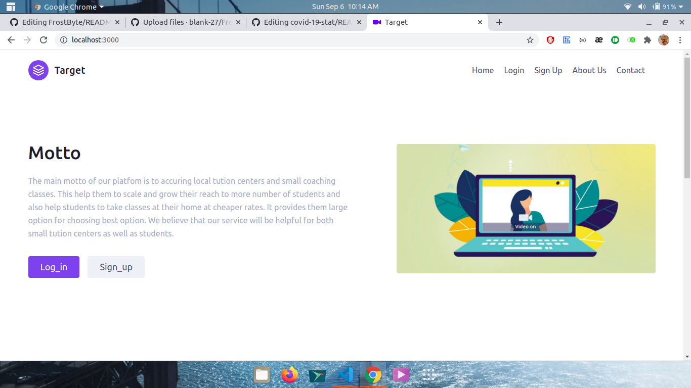
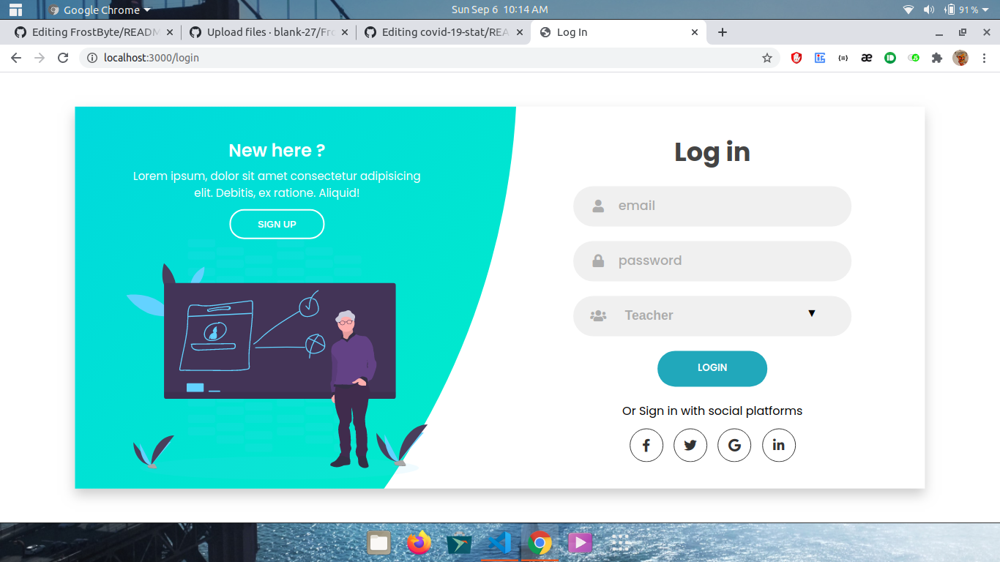
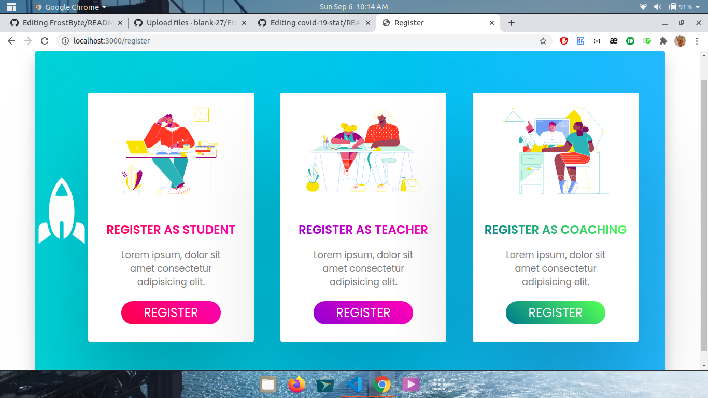
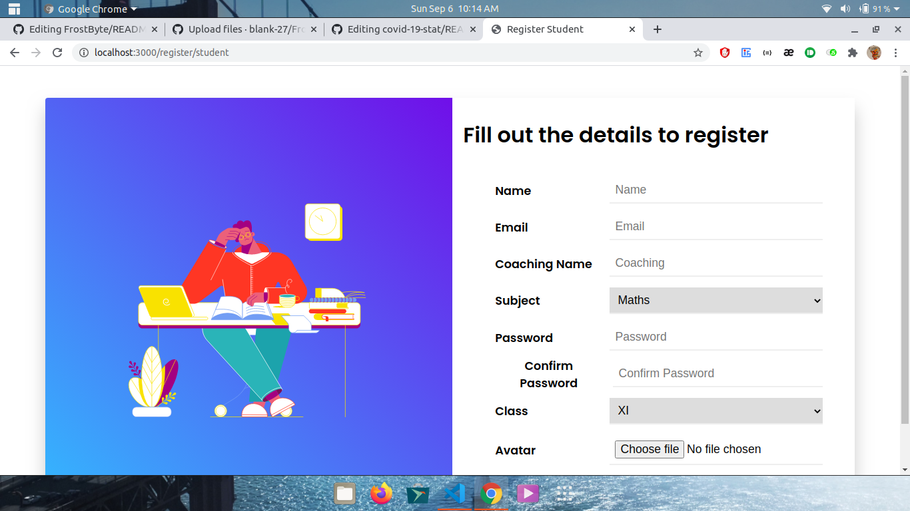
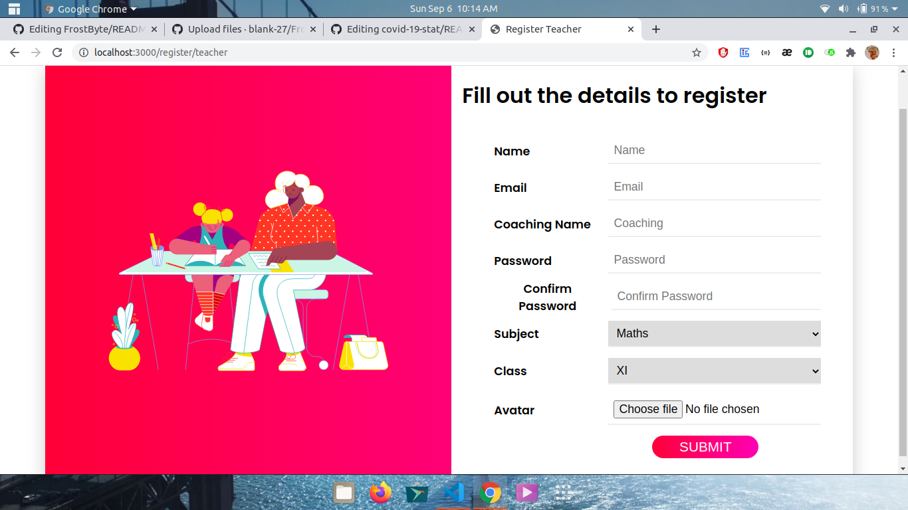
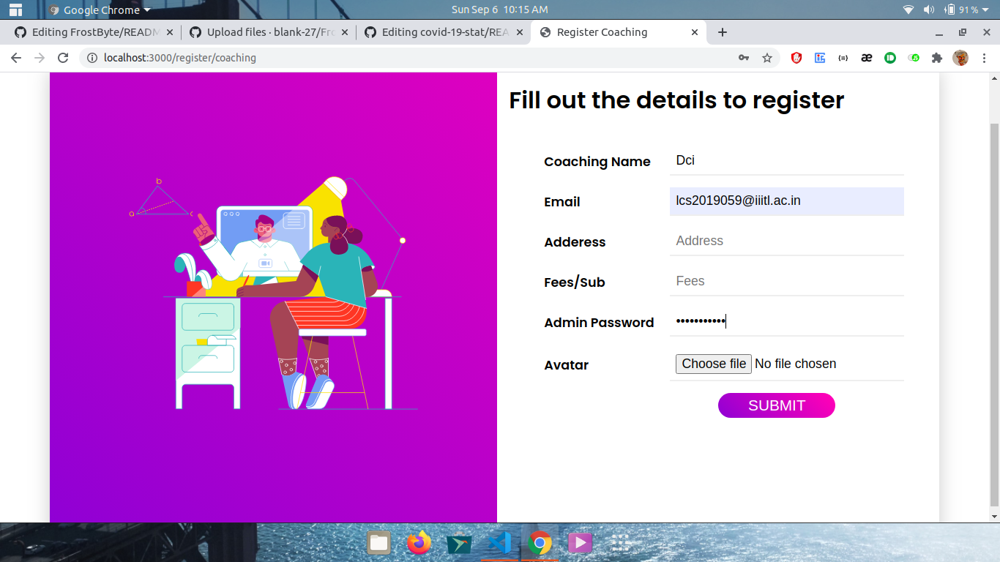
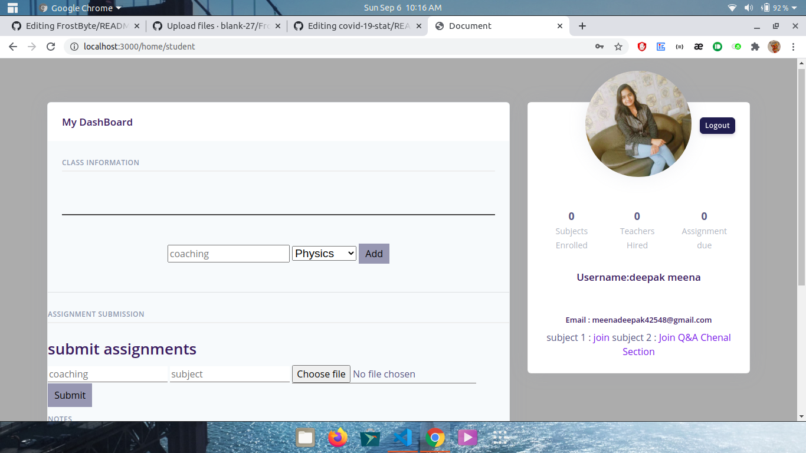
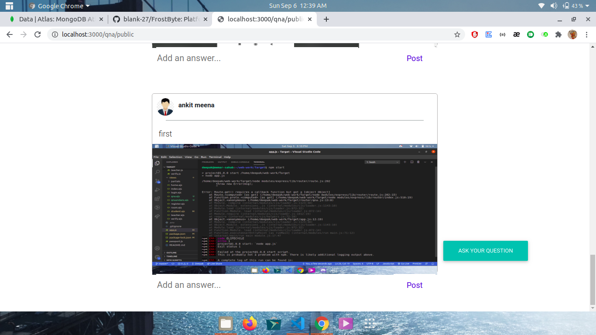
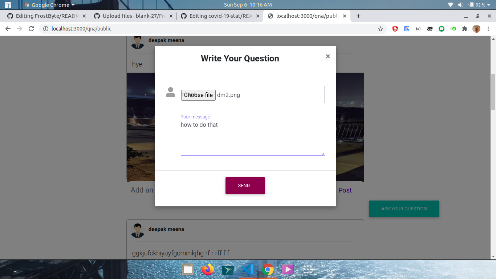

## Installation
To use the project locally make sure you have MongoDB and NodeJS installed .

To clone and run this application, you'll need [Git](https://git-scm.com) and [Node.js](https://nodejs.org/en/download/) (which comes with [npm](http://npmjs.com)) installed on your computer. From your command line:

```bash
# Clone this repository
$ git clone https://github.com/blank-27/FrostByte.git

# Go into the repository
$ cd FrostByte

# Install dependencies
$ npm install

# Run the app
$ npm run dev
## Contributing
1. Fork it!
2. Create your feature branch: `git checkout -b my-new-feature`
3. Commit your changes: `git commit -am 'Add some feature'`
4. Push to the branch: `git push origin my-new-feature`
5. Submit a pull request :

#images

<table>
  <tr>
      <td> <h1>screenshot in pc </h1></td>
  </tr>
   <tr>
      <td></td>
  </tr>
   <tr>
      <td></td>
  </tr>
   <tr>
      <td></td>
  </tr>
   <tr>
      <td></td>
  </tr>
   <tr>
      <td></td>
  </tr>
   <tr>
      <td></td>
  </tr>
   <tr>
      <td></td>
  </tr>
   <tr>
      <td></td>
  </tr>
   <tr>
      <td></td>
  </tr>
   <tr>
      <td></td>
  </tr>
 
</table>

